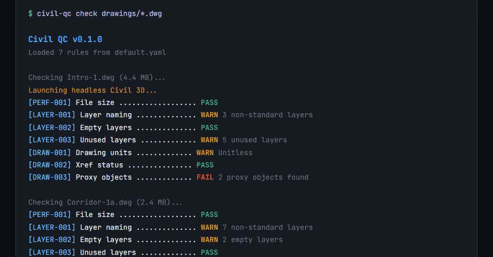

# civil-qa-qc

[](https://github.com/Asem-D/civil-qa-qc/actions/workflows/ci.yml)
[](LICENSE)
[](https://dotnet.microsoft.com/download)
[](https://dotnet.microsoft.com/download/dotnet-framework)
[](https://www.autodesk.com/products/civil-3d)

Open-source CLI tool for automated QA/QC of Civil 3D drawings. Runs configurable checks against your `.dwg` files and generates HTML/JSON reports.

> **Requires Civil 3D** (2020-2025) installed on the machine. The tool uses `accoreconsole.exe` to run checks headlessly, automating what you'd otherwise do manually in the Civil 3D GUI.



## Features

- **15 built-in rules**: Layer naming, empty layers, unused layers, color, linetype, drawing units, xrefs, proxy objects, annotation scale, text styles, block naming, block insertion point, drawing recovery, and more
- **Batch mode**: Check multiple drawings at once, with CSV and JSON export for CI/CD
- **AUDIT pre-step**: `--repair` flag runs AutoCAD AUDIT before checks to fix recoverable errors
- **YAML-configurable**: Define your own rules or customize built-in ones
- **HTML & JSON reports**: Visual HTML reports with screenshots, machine-readable JSON for CI/CD
- **CSV export**: Spreadsheet-friendly output for batch results
- **AI-powered** (optional, BYOK): Generate rules from natural language, summarize batch results
- **Multi-version**: .NET 8 for Civil 3D 2025+, .NET Framework 4.8 for Civil 3D 2020-2024

## Quick Start

```bash
# Build
dotnet build

# Run with default rules
civil-qc check drawing.dwg

# Batch mode with CSV export
civil-qc batch ./drawings/ --format both --csv results.csv

# Repair before checking (runs AUDIT)
civil-qc check drawing.dwg --repair

# Custom rules, both output formats
civil-qc check drawing.dwg --rules custom-rules.yaml --format both --verbose

# AI-powered fix suggestions
civil-qc check drawing.dwg --ai-fix
```

## Documentation

| Document | Audience | Description |
|----------|----------|-------------|
| [Getting Started](docs/getting-started.md) | Users | Installation, first check, understanding reports |
| [Configuration](docs/configuration.md) | Users | YAML structure, all rule parameters, project standards |
| [Custom Rules](docs/custom-rules.md) | Developers | Step-by-step guide to writing your own IRule |
| [Architecture](docs/architecture.md) | Contributors | How the CLI, Plugin, and Rules fit together |
| [CI/CD Integration](docs/ci-integration.md) | DevOps | GitHub Actions, Azure DevOps, batch scripts |
| [Troubleshooting](docs/troubleshooting.md) | Everyone | Common errors, fixes, FAQ |

## Architecture

```
civil-qc CLI  ──spawns──>  accoreconsole.exe  ──loads──>  CivilQc.Plugin.dll
    │                                                         │
    │  (outside AutoCAD)                    (inside headless Civil 3D)
    │                                                         │
    │  1. Load YAML rules                     3. Run IRule.Execute()
    │  2. Launch accoreconsole                4. Screenshot failures
    │  6. Generate HTML report                5. Write JSON results
    │                                                         │
    └──────────── report.html/json <──────────────────────────┘
```

## Built-in Rules

| ID | Check | Severity | Description |
|----|-------|----------|-------------|
| `PERF-001` | File Size | Info | Reports file size, warns at configurable thresholds |
| `LAYER-001` | Layer Naming | Warning | Validates layer names against allowed prefixes |
| `LAYER-002` | Empty Layers | Info | Finds layers with zero entities |
| `LAYER-003` | Unused Layers | Info | Finds frozen/off layers with zero entities |
| `DRAW-001` | Drawing Units | Warning | Reports INSUNITS; enforces expected unit |
| `DRAW-002` | Xref Status | Warning | Reports xref resolution, flags missing references |
| `DRAW-003` | Proxy Objects | Warning | Counts proxy entities, flags unsupported objects |
| `ANNO-001` | Annotation Scale | Warning | Detects annotative entities in ModelSpace |
| `ANNO-002` | Text Styles | Warning | Validates text styles against naming standards |
| `BLOCK-001` | Block Naming | Warning | Checks block names against prefix/suffix rules |
| `BLOCK-002` | Dynamic Blocks | Info | Reports dynamic blocks and their properties |
| `BLOCK-003` | Block Insertion Point | Warning | Detects blocks inserted at non-zero insertion points |
| `LAYER-004` | Layer Color | Warning | Validates layer colors against allowed values |
| `LAYER-005` | Layer Linetype | Warning | Validates layer linetypes against allowed values |
| `DWG-001` | Drawing Recovery | Critical | Detects recovery mode and audit status |

## Custom Rules

Create a `rules/custom.yaml`:

```yaml
rules:
  - id: CUSTOM-001
    name: My custom check
    check_type: LayerNaming
    severity: Error
    parameters:
      allowed_prefixes: [CIVIL, SURF, ROAD]
      require_prefix: true
```

See [Configuration](docs/configuration.md) for all rule parameters, or [Custom Rules](docs/custom-rules.md) for a step-by-step guide to writing new rules from scratch.

## AI Commands (Optional)

AI features are **entirely optional**. The tool works fully without an API key.

```bash
# Generate rules from a natural language description
civil-qc ai generate-rules --description "All layers must start with discipline prefix C-, S-, E-"

# Generate rules from a standards document
civil-qc ai generate-rules --file company-standards.txt --output rules/company.yaml

# Summarize batch results
civil-qc ai summarize --input ./results/ --output summary.md
```

Provide your API key via CLI flag (`--api-key`), environment variable (`CIVIL_QC_AI_KEY`), or config file (`~/.civil-qa-qc/config.json`). Works with OpenRouter, OpenAI, Ollama, or any OpenAI-compatible endpoint.

## Multi-version Support

| Branch | .NET Target | Civil 3D Version |
|--------|-------------|------------------|
| `main` | .NET 8 | Civil 3D 2025+ |
| `release/2024` | .NET Framework 4.8 | Civil 3D 2020-2024 |

## Extending

See [Custom Rules](docs/custom-rules.md) for a full step-by-step guide.

Drop a new `IRule` implementation into `CivilQc.Rules`:

```csharp
public class MyCustomRule : IRule
{
    public string RuleId => "CUSTOM-001";
    public string Name => "My Custom Check";

    public List<CheckResult> Execute(RuleDefinition rule, DrawingContext context)
    {
        // Your check logic here
        return new List<CheckResult> { /* ... */ };
    }
}
```

Rules are auto-discovered via reflection. No registration needed.

## Parameter Reference

| Rule | Parameter | Type | Default | Description |
|------|-----------|------|---------|-------------|
| `PERF-001` | `warning_mb` | int | 100 | File size warning threshold (MB) |
| `PERF-001` | `error_mb` | int | 500 | File size error threshold (MB) |
| `LAYER-001` | `allowed_prefixes` | list | `[]` | Allowed layer name prefixes |
| `LAYER-001` | `require_prefix` | bool | `true` | Fail layers without a prefix |
| `LAYER-001` | `separator` | string | `"-"` | Delimiter between prefix and suffix |
| `LAYER-002` | `exclude_defaults` | bool | `true` | Skip "0" and "Defpoints" |
| `LAYER-003` | `exclude_defaults` | bool | `true` | Skip "0" and "Defpoints" |
| `DRAW-001` | `expected` | string | `""` | Expected unit (e.g. "Meters"); empty = report only |
| `DRAW-002` | `fail_on_missing` | bool | `true` | Mark as failed when xrefs are missing |
| `DRAW-002` | `warn_on_overlay` | bool | `false` | Flag overlay-type xrefs |
| `DRAW-003` | `max_count` | int | 0 | Max proxy objects allowed; 0 = report only |
| `LAYER-004` | `allowed_colors` | list | `[]` | Allowed ACI color indices; empty = all allowed |
| `LAYER-004` | `forbid_bylayer_zero` | bool | `false` | Flag layers using color 0 (ByBlock) |
| `LAYER-005` | `allowed_linetypes` | list | `["Continuous","ByLayer","ByBlock"]` | Allowed linetype names |
| `BLOCK-003` | `origin_threshold` | float | 0.001 | Max distance from origin to flag |
| `BLOCK-003` | `skip_xrefs` | bool | `true` | Skip blocks from external references |

## Requirements

- .NET 8 SDK (for building)
- Civil 3D 2020-2025 installed (for running checks)
- `accoreconsole.exe` accessible on PATH or via `ACCORECONSOLE_PATH` env var

## Roadmap

See [ROADMAP.md](ROADMAP.md) for the full version timeline.

**Current**: v0.3.0 (15 rules, batch mode, CSV export, AUDIT pre-step)
**Next**: v0.4.0 (more rules, plugin architecture)

## Contributing

Contributions welcome! See [CONTRIBUTING.md](CONTRIBUTING.md) for guidelines.

1. Fork the repo
2. Create a feature branch
3. Add your rule implementing `IRule`
4. Submit a PR

## License

MIT License - see [LICENSE](LICENSE) for details.
